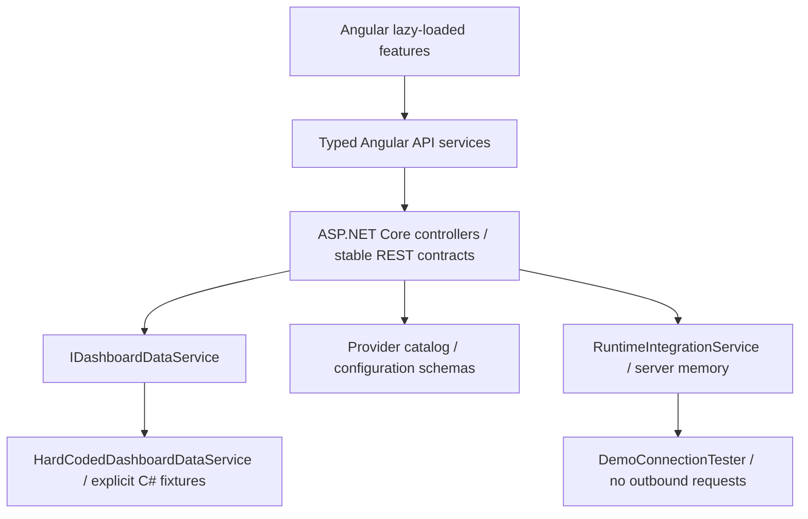

# Unified AI Consumption Dashboard

A working Angular + ASP.NET Core enterprise POC for Claude, OpenAI, Microsoft Copilot, ServiceNow, and runtime custom REST configurations.

**No database. No persistence. No data generator. No external provider calls.** All consumption observations are explicit C# fixtures. Runtime integration changes and credentials exist only in API process memory.

## Run locally

Prerequisites: **.NET 10 SDK**, **Node.js 24.15+**, npm. Angular 22 and Angular Material 22 are locked in `frontend/package-lock.json`.

From the repository root, open two terminals:

```powershell
# Terminal 1
dotnet run --project backend/UnifiedAI.Api
```

```powershell
# Terminal 2
cd frontend
npm ci
npm start
```

Open **http://localhost:4200**. The frontend proxies `/api` to **http://localhost:5080**. Swagger is at **http://localhost:5080/swagger**.

This workspace also contains ignored, locally downloaded tools. If Node/.NET 10 are not on PATH, use:

```powershell
# Terminal 1, repository root
$env:DOTNET_CLI_HOME="$PWD\.tools\cli"
& .\.tools\dotnet\dotnet.exe run --project backend/UnifiedAI.Api

# Terminal 2, repository root
$env:PATH="$PWD\.tools\node-v24.21.0-win-x64;$env:PATH"
& .\.tools\node-v24.21.0-win-x64\npm.cmd start --prefix frontend
```

No setup data, provider credentials, database connection strings, or migrations are needed.

## What is implemented

- Enterprise navigation and workspace shell, collapsible sidebar, light/dark mode, responsive charts and scrolling tables.
- Eight executive metrics; provider comparison; usage, token, provider-distribution, cost, and request-outcome analysis.
- Global date, provider, account, environment, team, model, metric, and granularity filters.
- Usage detail with API filtering, sorting and pagination; cost allocation by account/model/team.
- Providers and capability comparison; account and environment allocation.
- CSV reports for accounts, models, teams, and environments using active global filters.
- Illustrative alerts, runtime audit logs, integration details and sync history.
- Metadata-driven Angular Reactive Forms and Material stepper: choose provider → connection details → simulated test → review/add → initial sync.
- Integration view, edit, test, sync, enable/disable and delete.
- Safe error responses, correlation IDs, rate limiting, CORS, loading/empty/error UI states.
- Swagger/OpenAPI; backend, Angular, and headless browser tests.

## Architecture



The POC uses one API project with focused folders instead of multiple infrastructure layers.

```text
backend/
  UnifiedAI.sln
  UnifiedAI.Api/
    Controllers/        Thin HTTP endpoints
    Models/             Normalized DTOs and validation errors
    Data/               Explicit immutable demo observations
    Services/           Aggregation, schemas, runtime integration state
    Connectors/         Future provider connector contracts
  UnifiedAI.Tests/      Unit and in-process API tests
frontend/
  src/app/
    core/               Typed HTTP services, filters, models
    layout/             Workspace shell
    shared/             Charts, KPIs, status, dynamic forms, dialogs
    features/
      dashboard/
      analytics/
      integrations/
      workspace/        Providers, accounts, reports, alerts, audit, settings
  e2e/                  Browser workflow tests
docs/                   Architecture and validation notes
artifacts/              Browser verification screenshots
```

## Fixed demo data

`backend/UnifiedAI.Api/Data/DemoUsageData.cs` defines **120 explicit daily observations across August 12–September 10, 2026**, plus six previous-period account baseline rows dated August 1. `DemoAccounts.cs` defines six accounts.

No values are randomized, generated, date-shifted, or seeded at runtime. The small `Row` helper only attaches existing account metadata to each explicitly specified observation.

The default window totals:

| Metric | Value |
|---|---:|
| Requests | 1,454,490 |
| Input tokens | 26,525,500 |
| Output tokens | 10,349,775 |
| Total tokens | 36,875,275 |
| Estimated cost | $5,023.00 |
| Success rate | 99.0582% |
| Providers / accounts | 4 / 6 |

All cards, trend points, breakdowns, and filtered detail rows aggregate the same fixtures. Weekday/weekend variations and an elevated ServiceNow error observation are explicitly encoded.

Dates are **inclusive**. The UI initially uses the fixture window returned by `GET /api/metadata`, so it remains useful after September 2026. Date presets are anchored to the last demo day. Custom windows outside available observations show an empty state.

Previous-period comparisons use the six fixed monthly baseline records. These are not a full daily history. Custom periods without a matching baseline show “No baseline”; the UI explains this limitation.

Copilot and ServiceNow tokens in this POC are **illustrative demo metrics**, not claims about real API capability. Provider metadata must be revalidated against official APIs before real connectors are enabled. Unsupported metrics should be represented by `null` plus capability metadata, never manufactured zeroes.

## Integration walkthrough

1. Open **Integrations → Add integration**.
2. Choose **Anthropic Claude**.
3. Enter a name and a dummy Admin API key such as `demo-key`.
4. Test the connection. The response explicitly says **Demo Mode**.
5. Review masked credentials, then add the integration.
6. Run initial sync. The runtime integration is updated and an audit entry is recorded.

Connection simulations:

| Credential | Result |
|---|---|
| Any nonempty dummy value | Connected |
| Empty required value | MissingCredentials |
| `invalid-key` | AuthenticationFailed |
| `rate-limited` | RateLimited |
| `unavailable` | ProviderUnavailable |
| Malformed or non-HTTPS endpoint | InvalidEndpoint |

New integrations disappear when the API restarts. Default integrations reappear. Editing default connections requires supplying dummy credentials. Secrets entered during edit can be retained by the API when omitted, but the wizard asks for re-entry to perform a fresh unsaved connection test.

**Sync does not change historical consumption.** Default connections return 1,250 simulated processed records; newly added connections return zero historical records. Runtime connections do not alter the dashboard's four-provider/six-account fixture totals.

## Dynamic schemas and custom REST

`GET /api/providers/{providerType}/configuration-schema` returns field names, labels, input types, required/secret flags, choices, and conditional authentication requirements. Angular renders and validates those fields; it contains no provider credential field arrays.

ServiceNow supports Basic/OAuth2 form branches. Custom REST supports API key, Bearer, Basic, OAuth2, and custom-header configuration, including method, endpoint paths, optional headers/query parameters, and JSON response mapping.

Custom REST fields are validated and retained for demonstration only. This release does not execute endpoints, perform OAuth, paginate remote responses, or normalize live responses.

## Credential handling

- No entered credentials are saved to localStorage or browser persistence.
- Only the theme preference is stored in localStorage.
- Runtime secrets reside in a private server-memory collection separate from public integration DTOs.
- Fields marked `secret`, including custom headers and query parameters, are excluded from every GET response and review text is masked.
- Secrets are not written to disk or logged.
- Connections and sync are simulated and send no data to provider endpoints.
- API request bodies are not logged; errors return safe messages and correlation IDs.
- Authentication is intentionally absent. Run locally; add Entra ID/SSO and server-side RBAC before shared deployment.

## API endpoints

| Area | Endpoints |
|---|---|
| Metadata | `GET /api/metadata` |
| Dashboard | `GET /api/dashboard/summary`, `provider-summary`, `top-consumers` |
| Usage | `GET /api/usage`, `/api/usage/trends`, `token-trends`, `request-status` |
| Costs | `GET /api/costs/summary`, `/api/costs/trends` |
| Providers | `GET /api/providers`, `/{providerType}`, `/{providerType}/configuration-schema` |
| Integrations | `GET/POST /api/integrations`, `GET/PUT/DELETE /api/integrations/{id}` |
| Connection tests | `POST /api/integrations/test`, `POST /api/integrations/{id}/test` |
| Synchronization | `POST /api/integrations/{id}/sync`, `GET /api/integrations/{id}/sync-history` |
| Enable/disable | `PATCH /api/integrations/{id}/enabled` with `{"enabled":false}` |
| Governance | `GET /api/audit-logs`, `GET /api/alerts` |
| Health | `GET /api/health` |
| OpenAPI | `GET /swagger/v1/swagger.json` |

Analytics filters: `from`, `to`, `provider`, `account` (account ID), `environment`, `team`, `model`.

Trend metrics: `requests`, `inputTokens`, `outputTokens`, `totalTokens`, `cost`, `errors`. Granularity: `daily`, `weekly`, `monthly`.

Usage pagination: `page` (1-based), `pageSize` (1–200), `sortBy` (`date`, `provider`, `requests`, `cost`), `sortDirection` (`asc`/`desc`).

Audit supports provider, action, result, user, inclusive from/to dates and pagination. The UI displays the latest 200 entries; runtime history is bounded.

## Tests and builds

```powershell
dotnet build backend/UnifiedAI.sln
dotnet test backend/UnifiedAI.Tests
cd frontend
npm ci
npm run build
npm test
# Start API and frontend first. Browser tests default to installed Microsoft Edge.
npx playwright test
```

If Edge is unavailable, install Playwright Chromium with `npx playwright install chromium` and remove `channel: 'msedge'` from `playwright.config.ts`.

Stop a running Windows API process before rebuilding its executable to avoid file-lock errors. The API tests use an in-process host and need no running database or provider.

## Optional containers

```powershell
docker compose up --build
```

Two services only: frontend at localhost:4200 and API/Swagger at localhost:5080. There is no database container or volume. These containers are a local demo deployment and retain no integration data after restart.

## Future real-provider migration

1. Keep normalized DTOs, query conventions, and frontend service contracts.
2. Implement `IAIProviderConnector` for Claude, OpenAI, Copilot, ServiceNow, or Generic REST using verified official APIs.
3. Add a provider resolver and a `ProviderUsageService : IDashboardDataService` that normalizes and aggregates their results.
4. Replace the `IDashboardDataService` registration; Angular endpoints remain the same.
5. Supply accurate capability states (`supported`, `unsupported`, `unavailable`), including nullable unavailable metrics and actual versus estimated cost.
6. Replace runtime secret storage with a managed vault, add authentication/RBAC, timeouts/retry policies, endpoint allowlists and outbound-request protections.
7. Decide persistence and scheduling separately when requested. Neither belongs to the current POC.

Provider-specific behavior stays behind schemas and connector implementations; dashboard features operate on normalized metrics.

